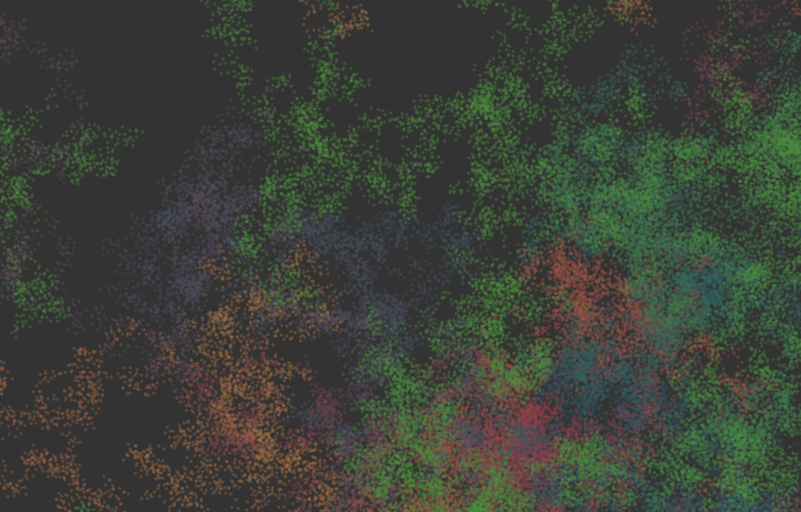

# random-walks

This is a javascript library for using different types of random walks. A random walk is a type of behavrior where an agent has a starting location and choses to walk a particular distance away from his current location in a random direction. I use this behavior in some of my work as an interesting type of creating point distributions within some of my generative work.

[**Take it for a test drive!**](https://evelios.github.io/random-walks/example.html)


[](https://evelios.github.io/random-walks/example.html)

## Instilation

```sh
npm install --save https://github.com/Evelios/random-walks.git
```

## Usage

This library works in node.js
```js
var randomWalks = require('random-walks');
```

And in the browser! (It includes the global variable `randomWalks`)
```html
<script type='text/javascript' src='./node_modules/random-walks.js'></script>
```
## Modules

All the functions in this module take two arguments. The bounding box that the random walk is to be performed inside and the options associated with that random walk. Different random walks will have different input options, but each of those options are listed under that particular walk. Some of the options are applicable to all of the functions, so I am going to list those here.

```js
const width   = 200;
const height  = 100;
const bbox    = [width, height];
const options = { ... };
const points  = walkFn(bbox, options);
```

**Options**
* `startingPoint` - If the random walk happens to leave the boundary of the 
  + function that takes the bbox as an argument and returns a point in the bounding box
* `min_step` - The minimum allowed step size
* `max_step` - The maximum allowed step size
* `num_steps` - The number of steps to run
* `num_walkers` - The number of times to run the algorithm

### random distribution

```js
const random = randomWalks.random;
```

### random walk

```js
const randomWalk = randomWalks.randomWalk;
```

### levy flight

**Options**
* `mu` - The power law variable

```js
const levyFlight = randomWalks.levyFlight;
```

# TODO

* Properly implement the options for all modules
  + general options
  + module specific options
* Implement other types of random walks
  + general gaussian random walks
  + find other types of random walks
    - square distribution
    - logorithmic distribution

# Patch History

### Version 1.0

This is the initial release.

